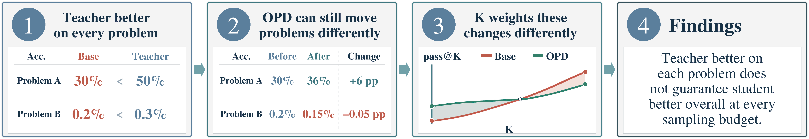
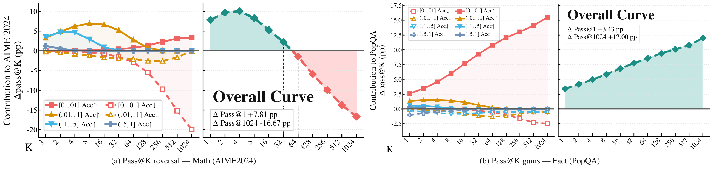
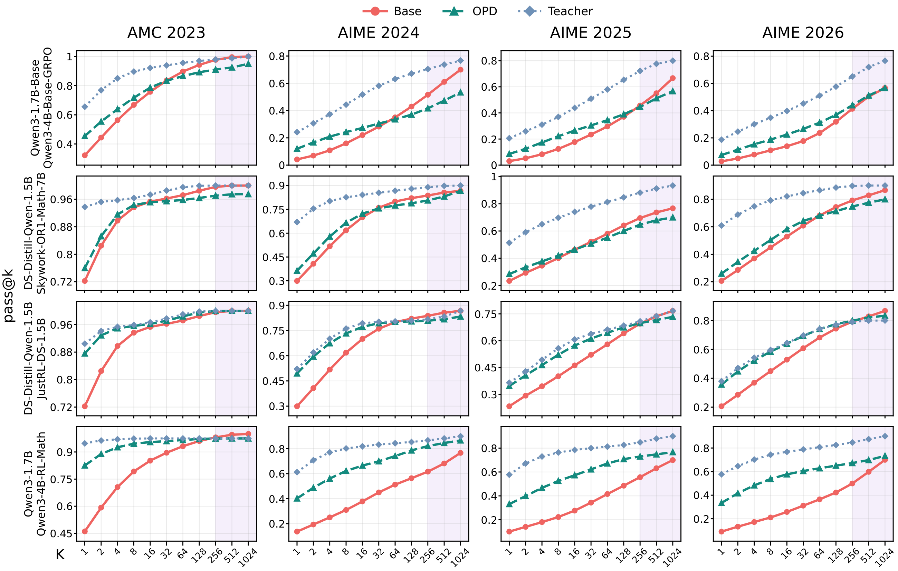
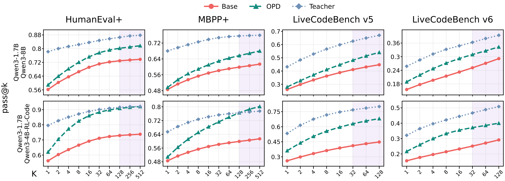
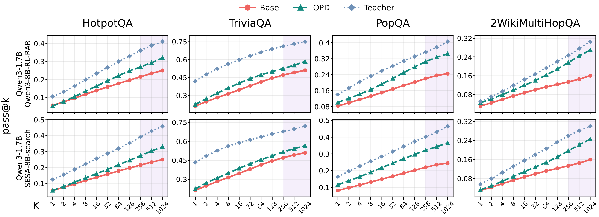
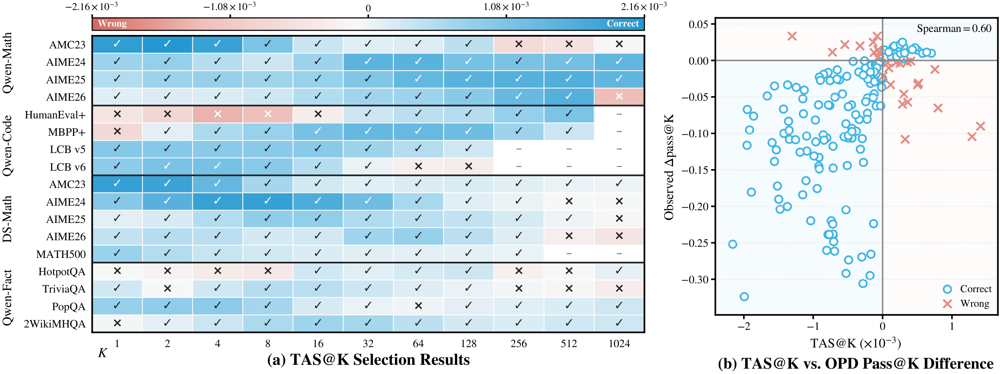

# Towards Understanding On-Policy Distillation through the Lens of Test-Time Scaling

Code and resources for our [paper](https://arxiv.org/abs/2608.11829). We release
our OPD checkpoints, frozen training and evaluation code, benchmark inputs or
download scripts, and data behind the main figures and tables.

[](https://arxiv.org/abs/2608.11829)
[](https://j3ra1d.top/opd-test-time-scaling/)
[](https://huggingface.co/collections/Geraldxm/opd-test-time-scaling-math-code-and-fact-checkpoints-6aba42275d3362d882cfc472)
[](#code-and-data)
[](LICENSE)

[Main findings](#main-findings) · [Quick reproduction](#quick-reproduction) · [Citation](#citation)

## Main findings

### 1. OPD gains depend on the sampling budget

A stronger teacher does not guarantee that the OPD-trained student improves at
every sampling budget. The paper's schematic shows how an improvement on one
problem and a small decline on another can produce a pass@K reversal.

[](assets/readme/teaser_compact.png)

### 2. Gains can persist or reverse as K grows

Across the evaluated settings, some pass@K gains persist or widen, while others
reverse at large K. The paper's AIME2024 and PopQA examples show how changes on
different problem groups contribute to these two outcomes.

[](assets/readme/pass_at_k_decomposition.png)

<details>
<summary>Full pass@K curves across Math, Code, and Fact</summary>

**Math.** Gains narrow or reverse on several benchmarks at large K.

[](assets/readme/pass_at_k_math.png)

**Code.** Gains persist and sometimes widen in both settings.

[](assets/readme/pass_at_k_code.png)

**Fact.** Both settings remain ahead of their pre-OPD base model at K=1024.

[](assets/readme/pass_at_k_fact.png)

</details>

### 3. TAS@K helps choose a teacher before training

The Teacher Advantage Score at K (TAS@K) compares two candidate teachers using
pre-OPD base-model responses and their likelihoods under both teachers. In the
paper's reported comparisons, its selection agrees with the OPD-trained model
that achieves higher pass@K in
**148/177 cases (83.6%)**.

[](assets/readme/tas_at_k.png)

The plotted values are available in [paper_results/](paper_results/); the TAS@K
calculator is [here](analysis/compute_tas_at_k.py).

## Code and data

- **Training:** [OPD engine and one-step example](training/README.md), plus
  [Math, Code, and Fact training-data instructions](training/data/README.md).
- **Inference and evaluation:** frozen [math-eval](evaluation/math_eval/README.md)
  and benchmark packages for [Math](evaluation/benchmarks/Math/README.md),
  [HumanEval+](evaluation/benchmarks/HumanEval+/README.md),
  [MBPP+](evaluation/benchmarks/MBPP+/README.md),
  [LiveCodeBench](evaluation/benchmarks/LiveCodeBench/README.md), and
  [FactQA](evaluation/benchmarks/FactQA/README.md).
- **Paper data:** [figure/table CSVs and release checksums](paper_results/README.md).

The Fact **training** data includes NQ and HotpotQA. The NQ evaluation set and
MATH500 question data are not included; large LiveCodeBench test files use the
pinned download script in its benchmark directory.

## Checkpoints

Our seven trained checkpoints are in the
[Hugging Face collection](https://huggingface.co/collections/Geraldxm/opd-test-time-scaling-math-code-and-fact-checkpoints-6aba42275d3362d882cfc472).
The table also links the base and teacher models for all eight paper settings:

| Domain | OPD checkpoint | Base | Teacher |
| --- | --- | --- | --- |
| Math | [Qwen3-1.7B-Base-OPD](https://huggingface.co/Thinking-Space/Qwen3-1.7B-Base-OPD) | [Qwen3-1.7B-Base](https://huggingface.co/Qwen/Qwen3-1.7B-Base) | [Qwen3-4B-Base-GRPO](https://huggingface.co/Thinking-Space/Qwen3-4B-Base-GRPO) |
| Math | [Math-DeepSeek-R1-Distill-Qwen-1.5B-Skywork-OR1-Math-7B](https://huggingface.co/Geraldxm/Math-DeepSeek-R1-Distill-Qwen-1.5B-Skywork-OR1-Math-7B) † | [DeepSeek-R1-Distill-Qwen-1.5B](https://huggingface.co/deepseek-ai/DeepSeek-R1-Distill-Qwen-1.5B) | [Skywork-OR1-Math-7B](https://huggingface.co/Skywork/Skywork-OR1-Math-7B) |
| Math | [Math-DeepSeek-R1-Distill-Qwen-1.5B-JustRL-DeepSeek-1.5B](https://huggingface.co/Geraldxm/Math-DeepSeek-R1-Distill-Qwen-1.5B-JustRL-DeepSeek-1.5B) † | [DeepSeek-R1-Distill-Qwen-1.5B](https://huggingface.co/deepseek-ai/DeepSeek-R1-Distill-Qwen-1.5B) | [JustRL-DeepSeek-1.5B](https://huggingface.co/hbx/JustRL-DeepSeek-1.5B) |
| Math | [Math-Qwen3-1.7B-Qwen3-4B-Non-Thinking-RL-Math-Step500](https://huggingface.co/Geraldxm/Math-Qwen3-1.7B-Qwen3-4B-Non-Thinking-RL-Math-Step500) † | [Qwen3-1.7B](https://huggingface.co/Qwen/Qwen3-1.7B) | [Qwen3-4B-Non-Thinking-RL-Math-Step500](https://huggingface.co/Keven16/Qwen3-4B-Non-Thinking-RL-Math-Step500) |
| Code | [Code-Qwen3-1.7B-Qwen3-8B](https://huggingface.co/Geraldxm/Code-Qwen3-1.7B-Qwen3-8B) † | [Qwen3-1.7B](https://huggingface.co/Qwen/Qwen3-1.7B) | [Qwen3-8B](https://huggingface.co/Qwen/Qwen3-8B) |
| Code | [Code-Qwen3-1.7B-Qwen3-4B-Non-Thinking-RL-Code-Step300](https://huggingface.co/Geraldxm/Code-Qwen3-1.7B-Qwen3-4B-Non-Thinking-RL-Code-Step300) † | [Qwen3-1.7B](https://huggingface.co/Qwen/Qwen3-1.7B) | [Qwen3-4B-Non-Thinking-RL-Code-Step300](https://huggingface.co/Keven16/Qwen3-4B-Non-Thinking-RL-Code-Step300) |
| Fact | [Fact-Qwen3-1.7B-Qwen3-8B-GRPO-Binary-RAR](https://huggingface.co/Geraldxm/Fact-Qwen3-1.7B-Qwen3-8B-GRPO-Binary-RAR) † | [Qwen3-1.7B](https://huggingface.co/Qwen/Qwen3-1.7B) | [Qwen3-8B-GRPO-Binary-RAR](https://huggingface.co/chentong00/Qwen3-8B-GRPO-Binary-RAR) |
| Fact | [Fact-Qwen3-1.7B-SESA-8B-search](https://huggingface.co/Geraldxm/Fact-Qwen3-1.7B-SESA-8B-search) † | [Qwen3-1.7B](https://huggingface.co/Qwen/Qwen3-1.7B) | [SESA-8B-search](https://huggingface.co/kuailexuexi/SESA-8B-search) |

† Trained and released by us. The unmarked OPD checkpoint was released by the
original authors.

## Quick reproduction

The included Math example generates two responses for one AMC2023 problem. To
evaluate a released checkpoint, set `model.path` in the
[config](evaluation/benchmarks/Math/configs/amc2023_smoke.yaml) to that checkpoint.
Run the example with a compatible GPU:

```bash
cd evaluation/math_eval
python scripts/evaluate.py --config ../benchmarks/Math/configs/amc2023_smoke.yaml --run-id amc2023-smoke
python scripts/replay_evaluation.py --run-dir outputs/runs/amc2023-smoke --parser-id math-v5.2-dual --k 1 2
```

Existing Math, Code, and Fact responses can be scored on CPU using the linked
benchmark READMEs; the Code judges require their documented Linux sandbox.
Inspecting the figure CSVs also needs only CPU. Repeating inference or training
needs model access and compute. Complete paper rollouts and the large TAS@K
likelihood inputs are not bundled.

## Citation

```bibtex
@misc{ge2026understandingonpolicydistillationlens,
  title={Towards Understanding On-Policy Distillation through the Lens of Test-Time Scaling},
  author={Xinmu Ge and Zizhuo Zhang and Yu Huang and Jianing Zhu and Lin Yuan and Wanli Gu and Weichang Wu and Weiran Huang and Xiaolu Zhang and Bo Han and Jun Zhou and Jiangchao Yao},
  year={2026},
  eprint={2608.11829},
  archivePrefix={arXiv},
  primaryClass={cs.LG},
  url={https://arxiv.org/abs/2608.11829},
}
```

See [CITATION.bib](CITATION.bib) for the same entry. Our code is
[Apache-2.0 licensed](LICENSE); third-party sources retain their
[own terms](THIRD_PARTY_NOTICES.md).
